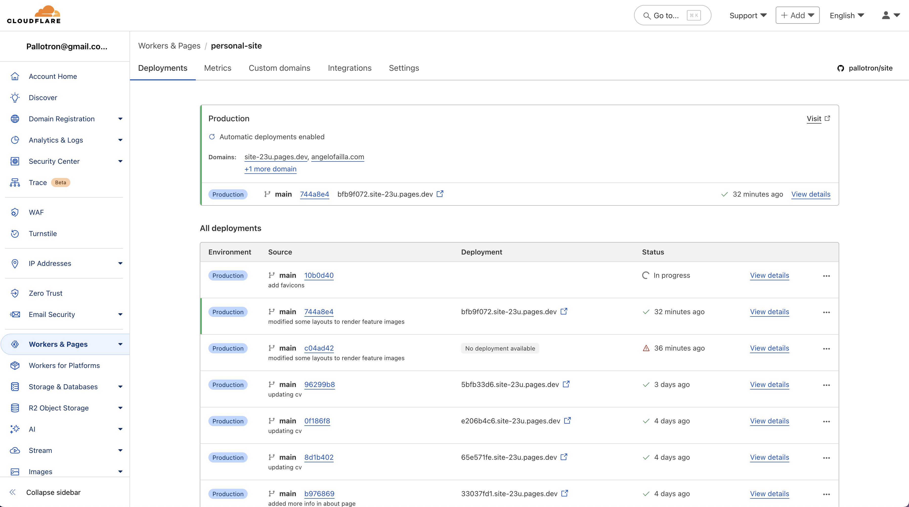

+++
date = '2025-03-20T17:45:16Z'
draft = false
title = 'Playing with hugo'
tags = ["hugo", "gohugo", "wordpress", "static-site-generator", "cloudflare", "ci-cd", "github", "tech"]
featured_image = 'hugo.png'
+++

I have decided to retire my old wordpress blog and set up a statically generated
site using [hugo](https://gohugo.io/).

Hugo is pretty nice :)
It is super fast, I don't have to setup a LAMP stack with webserver, mysql database and PHP.
It is much more secure and I don't have to worry about hosting things on my DigitalOcean VPS and worry about hacking attack etc.
In fact, I have even destroyed my VPS and save some money.

I have set up the project on [Github](https://github.com/pallotron/site) and configured [Cloudflare](https://www.cloudflare.com/en-gb/) to automatically build the static website and push it to a worker/page.

Now as soon as I `git push` to my github repo the site gets build by the cloudfare automation and pushed.

Then configured my DNS records to point to the cloudfare worker/page.
