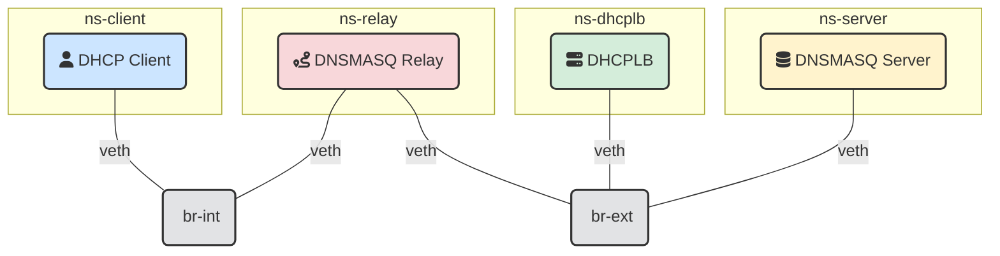
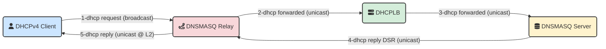
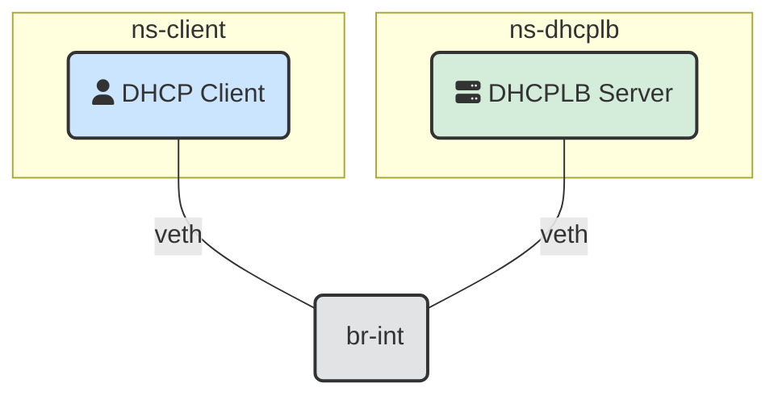

Revamping PXE boot stacks seems to be a recurring theme in my career, and my
current workplace is no exception. I am part of a tiger team tasked with a
significant overhaul of our pxeboot stack on our datacenters, but I am facing a
common problem: no access to a dedicated hardware lab for safe testing.
We are working on it but in the meantime I could not afford to get stuck.
I needed a scalable and scriptable solution that would work on my MacBook and in
our CI/CD pipelines.

For the DHCP component of this project, I chose to reuse [dhcplb](https://github.com/facebookincubator/dhcplb),
a tool I'm intimately familiar with, having
[co-created it with my colleagues at Facebook](https://engineering.fb.com/2016/09/13/data-infrastructure/dhcplb-an-open-source-load-balancer/).
I knew it was powerful, but it was missing a key feature for my use case: direct
support for broadcast (DHCPv4) and multicast (DHCPv6) traffic.

At Facebook, `dhcplb` only ever handled unicast, as the network relies on DHCP
relays in the top-of-rack switches. The need for broadcast support was something
I had anticipated since 2016, when I first
[opened an issue](https://github.com/facebookincubator/dhcplb/issues/1) for it.
Almost a decade later, it was time to implement it. But to do so, I needed a
reliable way to test.

This challenge led me to create the testing environment detailed in this post,
all based on a powerful, yet often underutilized, feature of the Linux kernel:
**network namespaces**. In this article, we'll explore how the use of a
clever combination of namespaces, virtual Ethernet (veth) pairs, and bridges can
be used to create a fully isolated, scriptable test lab that can run anywhere:
like your laptop or your CI/CD pipeline virtual runners.

## The Building Blocks: Namespaces, Veth Pairs, and Bridges

Before diving into the lab I built to test my recent `dhcplb` changes, let's quickly
recap the tools at our disposal:

*   **Network Namespaces (`ip netns`)**: A network namespace is a logical copy
    of the network stack, complete with its own interfaces, routing tables, and
    firewall rules. Processes running in one namespace are isolated from
    others. It's like having a separate, virtual machine for networking, but
    with minimal overhead.
*   **Virtual Ethernet Pairs (`veth`)** ([man page](https://man7.org/linux/man-pages/man4/veth.4.html)): 
    A `veth` pair is a simple concept:
    it's a link with two ends. A particularly
    interesting use case is to place one end of a veth pair in one
    network namespace and the other end in another network namespace,
    thus allowing communication between network namespaces.
*   **Network Bridges (`brctl` or `ip link`)**: A bridge is a virtual switch.
    They are necessary when you are working 3 or more network namespaces.
    A bridge can connect multiple network interfaces (like one end of a `veth` pair)
    together, allowing them to communicate as if they were on a switch on the same physical
    network segment.

By combining these three tools, we can build any network topology we can
imagine, all on a single Linux host.

## Visualizing the Topologies

To better understand the test scenarios, here are diagrams of the virtual
networks created by the lab scripts.

### Relay Lab Topology

This is the standard 4-actor topology that simulates `dhcplb` operating as a
load balancer, actors are:

*   a dhcp `client` in the `ns-client` namespace
*   a dhcp `relay` in the `ns-relay` namespace
*   a dhcplb instance acting as load balancer in the `ns-dhcplb` namespace
*   and finally a dhcp `server` in the `ns-server` namespace



### Packets Flows

The flow of DHCPv4 packets is as follows, the server directly responds to the relay skipping the LB (aka D.S.R.: Direct Server Return).



In contrast to that, the flow of DHCPv6 packets is as follows, the relay traverses the LB to the server.

```mermaid
graph LR
    Client("fa:fa-user DHCPv6 Client")
    Relay("fa:fa-route DNSMASQ Relay")
    DHCPLB("fa:fa-server DHCPLB")
    Server("fa:fa-database DNSMASQ Server")

    Client -- "1-dhcp request (multicast)" ---> Relay
    Relay -- "2-dhcp forwarded (unicast)" ---> DHCPLB
    DHCPLB -- "3-dhcp forwarded (unicast)" ---> Server
    Server -- "4-dhcp reply (unicast)" ---> DHCPLB
    DHCPLB -- "5-dhcp reply (unicast)" ---> Relay
    Relay -- "6-dhcp reply (unicast @ L2)" ---> Client

    style Client fill:#cce5ff,stroke:#333,stroke-width:2px
    style Relay fill:#f8d7da,stroke:#333,stroke-width:2px
    style DHCPLB fill:#d4edda,stroke:#333,stroke-width:2px
    style Server fill:#fff3cd,stroke:#333,stroke-width:2px
```



### Server/Broadcast Lab Topology

This 3-actor topology places `dhcplb` acting as a standard DHCP server, 
as the first-hop relay for the client,
testing its ability to handle broadcast/multicast packets directly.



## What About macOS? Enter Lima

But what if your development machine isn't running Linux? Network namespaces
are a Linux-specific kernel feature. The `dhcplb` project solves this
elegantly using [Lima (Linux virtual machines on macOS)](https://github.com/lima-vm/lima).

The `tests` directory contains a `dhcplb-vm.yaml` file that defines a
lightweight Ubuntu VM. The `Makefile` seamlessly manages this VM, starting it
when needed and executing all the test commands inside it. This approach
provides the best of both worlds:

*   **Developers on macOS** can run the full, Linux-based integration test
    suite with a single `make` command.
*   **CI/CD pipelines** (like GitHub Actions) can run the same test scripts
    directly on a Linux runner, without the overhead of a VM.

## Under the Hood: A Look at the `dhcplb` Test Lab Code

### Testing the relay topology

The `dhcplb` test lab, found in the `/tests` directory, provides a fantastic,
real-world example of these concepts in action. Let's walk through how the
`relay` mode topology is constructed using shell commands from the
`setup_relay_mode.sh` script.

**The Goal:** Create the following network:
`[ ns-client ] <-> [ br-int ] <-> [ ns-relay ] <-> [ br-ext ] <-> [ ns-dhcplb ] <-> [ ns-server ]`

**Step 1: Create the Namespaces**

First, each actor in our simulation gets its own isolated network stack.

```bash
# From includes/setup_relay_mode.sh
ip netns add "ns-client"
ip netns add "ns-relay"
ip netns add "ns-dhcplb"
ip netns add "ns-server"
```

**Step 2: Create the Virtual Switches (Bridges)**

Next, two bridges are created to act as our internal and external networks.

```bash
# From includes/setup_relay_mode.sh
ip link add name "br-int" type bridge
ip link set "br-int" up
ip link add name "br-ext" type bridge
ip link set "br-ext" up
```

**Step 3: Connect the Client to the Internal Bridge**

To connect the `ns-client` namespace to the `br-int` bridge, a `veth` pair is
created. One end (`v-cli`) is moved into the namespace, and the other end
(`v-br-cli`) is attached to the bridge.

```bash
# Create the virtual patch cable
ip link add "v-cli" type veth peer name "v-br-cli"

# Plug one end into the namespace
ip link set "v-cli" netns "ns-client"

# Plug the other end into the bridge
ip link set "v-br-cli" master "br-int"

# Bring the interfaces up
ip link set "v-br-cli" up
ip netns exec "ns-client" ip link set dev "v-cli" up
```
This process is repeated for every connection in the topology diagram,
methodically building the virtual network, piece by piece.

**Step 4: Assigning IP Addresses**

Once the interfaces are in place, they are assigned IP addresses within their
respective namespaces. For example, the `ns-relay` namespace gets IPs on both
the internal and external networks.

```bash
# From includes/setup_relay_mode.sh

# Assign 192.168.100.1 to the relay's internal interface
ip netns exec "ns-relay" ip addr add "192.168.100.1/24" dev "v-rly-int"

# Assign 192.168.200.1 to the relay's external interface
ip netns exec "ns-relay" ip addr add "192.168.200.1/24" dev "v-rly-ext"
```

**Step 5: Running the Services and the Test**

With the topology built, the `Makefile` can now orchestrate the test. It uses
`ip netns exec` to run each service within its designated namespace,
redirecting their output to log files.
### Testing the Server/Broadcast Topology

The `server` mode topology is simpler. It tests `dhcplb`'s ability to act as a standalone DHCP server, directly responding to broadcast (DHCPv4) and multicast (DHCPv6) discovery packets from clients on the same network segment.

**The Goal:** Create the following network:
`[ ns-client ] <-> [ br-int ] <-> [ ns-dhcplb ]`

**Step 1: Create Namespaces and the Bridge**

Only two namespaces are needed: one for the client and one for `dhcplb`. A single bridge connects them.

```bash
# From includes/setup_server_mode.sh
ip netns add "ns-client"
ip netns add "ns-dhcplb"

ip link add name "br-int" type bridge
ip link set "br-int" up
```

**Step 2: Connect the Actors to the Bridge**

Both the client and `dhcplb` are connected to the `br-int` bridge using `veth` pairs.

```bash
# From includes/setup_server_mode.sh

# Connect the client
ip link add "v-cli" type veth peer name "v-br-cli"
ip link set "v-cli" netns "ns-client"
ip link set "v-br-cli" master "br-int"
ip link set "v-br-cli" up
ip netns exec "ns-client" ip link set dev "v-cli" up

# Connect dhcplb
ip link add "v-lb" type veth peer name "v-br-lb"
ip link set "v-lb" netns "ns-dhcplb"
ip link set "v-br-lb" master "br-int"
ip link set "v-br-lb" up
ip netns exec "ns-dhcplb" ip link set dev "v-lb" up
```

**Step 3: Assign an IP Address to `dhcplb`**

`dhcplb` needs an IP address on the network to serve DHCP requests. The client's interface is left unconfigured, as it will request an address via DHCP.

```bash
# From includes/setup_server_mode.sh
ip netns exec "ns-dhcplb" ip addr add "192.168.100.1/24" dev "v-lb"
ip netns exec "ns-dhcplb" ip -6 addr add "fd00:100::1/64" dev "v-lb"
```

**Step 4: Running the Services and the Test**

With the topology built, the `Makefile` can now orchestrate the test. It uses
`ip netns exec` to run each service within its designated namespace,
redirecting their output to log files.

### Configuration in Action

The setup scripts dynamically generate the configuration for each service.
Let's look at what they contain for each mode.

**Relay Mode: Backend DHCP Server (`dnsmasq` in `ns-server`)**
This configuration, generated by `render_dnsmasq_server_config`, tells `dnsmasq`
to act as a standard DHCP server, handing out IPs from a defined range.

```ini
# /etc/dhcplb_lab/dnsmasq-server.conf
interface=v-srv
port=0
dhcp-range=192.168.100.10,192.168.100.50,12h
dhcp-range=fd00:100::10,fd00:100::50,12h
dhcp-option=option:router,192.168.100.1
log-dhcp
dhcp-leasefile=/var/lib/dhcp/dnsmasq.leases
```

**Relay Mode: DHCP Relay (`dnsmasq` in `ns-relay`)**
This `dnsmasq` instance is configured as a relay. It listens on its internal
interface and forwards any DHCP requests it receives to the `dhcplb` IP address
(`192.168.200.2`).

```ini
# /etc/dhcplb_lab/dnsmasq-relay.conf
port=0
interface=v-rly-int
interface=v-rly-ext
dhcp-relay=192.168.100.1,192.168.200.2
dhcp-relay=fd00:100::1,fd00:200::2
enable-ra
log-dhcp
```

**Relay Mode: DHCPLB Configuration**
Finally, the `dhcplb` configuration tells the service to listen for packets and
specifies a file from which to read the list of available backend DHCP servers.

```json
// /etc/dhcplb_lab/dhcplb.config.json (relay mode)
{
  "v4": {
    "version": 4,
    "listen_addr": "0.0.0.0",
    "port": 67,
    "host_sourcer": "file:/etc/dhcplb_lab/dhcp-servers-v4.cfg"
  },
  "v6": {
    "version": 6,
    "listen_addr": "fd00:200::2",
    "port": 547,
    "host_sourcer": "file:/etc/dhcplb_lab/dhcp-servers-v6.cfg"
  }
}
```

**Server Mode: DHCPLB Configuration**
In server mode, `dhcplb` is configured with a `range` handler, allowing it to
manage a pool of IP addresses and act as a full-fledged DHCP server.

```json
// /etc/dhcplb_lab/dhcplb.config.json (server mode)
{
  "v4": {
    "version": 4,
    "listen_addr": "0.0.0.0",
    "port": 67,
    "handler": {
      "type": "range",
      "start_ip": "192.168.100.10",
      "end_ip": "192.168.100.50",
      "lease_time": "10m",
      "lease_file": "/etc/dhcplb_lab/dhcplb-v4.leases",
      "options": {
        "subnet-mask": "255.255.255.0",
        "router": "192.168.100.1"
      }
    }
  },
  "v6": {
    "version": 6,
    "listen_addr": "::",
    "port": 547,
    "handler": {
      "type": "range",
      "start_ip": "fd00:100::10",
      "end_ip": "fd00:100::50",
      "lease_time": "10m",
      "lease_file": "/etc/dhcplb_lab/dhcplb-v6.leases",
      "options": {
        "dns-server": ["fd00:100::1"]
      }
    }
  }
}
```

### Kicking off the Tests

The actual tests are triggered by running a DHCP client in the `ns-client`
namespace.

**Relay Mode Test**
This command asks the client to get a lease on its virtual interface, `v-cli`,
which is then relayed to `dhcplb`.

```makefile
# From tests/Makefile
test-relay-v4: delete-lease
	@echo "▶️  Running DHCPv4 RELAY client test..."
	@limactl shell $(LIMA_INSTANCE_NAME) sudo ip netns exec ns-client dhclient -v -1 v-cli

test-relay-v6: delete-lease
	@echo "▶️  Running DHCPv4 RELAY client test..."
	@limactl shell $(LIMA_INSTANCE_NAME) sudo ip netns exec ns-client dhclient -6 -v -1 v-cli
```

The test passes if `dhclient` successfully obtains a lease, proving that the
entire chain—from client to relay to `dhcplb` to the server and back—is working
correctly.

Here is the tcpdump proving this worked for `DHCPv4`:

```bash
root@lima-dhcplb-vm:~# tcpdump -l -i any 'udp port 67 or udp port 68'
tcpdump: WARNING: any: That device doesn't support promiscuous mode
(Promiscuous mode not supported on the "any" device)
tcpdump: data link type LINUX_SLL2
tcpdump: verbose output suppressed, use -v[v]... for full protocol decode
listening on any, link-type LINUX_SLL2 (Linux cooked v2), snapshot length 262144 bytes
22:28:41.087260 v-br-cli B   IP 0.0.0.0.bootpc > 255.255.255.255.bootps: BOOTP/DHCP, Request from 02:66:b4:13:54:2c (oui Unknown), length 300
22:28:41.087281 v-br-srv-int Out IP 0.0.0.0.bootpc > 255.255.255.255.bootps: BOOTP/DHCP, Request from 02:66:b4:13:54:2c (oui Unknown), length 300
22:28:41.087282 v-br-rly-int Out IP 0.0.0.0.bootpc > 255.255.255.255.bootps: BOOTP/DHCP, Request from 02:66:b4:13:54:2c (oui Unknown), length 300
22:28:41.087260 br-int B   IP 0.0.0.0.bootpc > 255.255.255.255.bootps: BOOTP/DHCP, Request from 02:66:b4:13:54:2c (oui Unknown), length 300
22:28:41.088466 v-br-rly-ext P   IP relay-int.bootps > dhcplb.bootps: BOOTP/DHCP, Request from 02:66:b4:13:54:2c (oui Unknown), length 300
22:28:41.088467 v-br-lb Out IP relay-int.bootps > dhcplb.bootps: BOOTP/DHCP, Request from 02:66:b4:13:54:2c (oui Unknown), length 300
22:28:41.088953 v-br-lb P   IP dhcplb.bootps > server.bootps: BOOTP/DHCP, Request from 02:66:b4:13:54:2c (oui Unknown), length 300
22:28:41.088955 v-br-srv Out IP dhcplb.bootps > server.bootps: BOOTP/DHCP, Request from 02:66:b4:13:54:2c (oui Unknown), length 300
22:28:44.123169 v-br-srv-int P   IP 192.168.100.3.bootps > relay-int.bootps: BOOTP/DHCP, Reply, length 300
22:28:44.123178 v-br-rly-int Out IP 192.168.100.3.bootps > relay-int.bootps: BOOTP/DHCP, Reply, length 300
22:28:44.123610 v-br-rly-int P   IP relay-int.bootps > 192.168.100.12.bootpc: BOOTP/DHCP, Reply, length 300
22:28:44.123678 v-br-cli Out IP relay-int.bootps > 192.168.100.12.bootpc: BOOTP/DHCP, Reply, length 300
22:28:44.124201 v-br-cli B   IP 0.0.0.0.bootpc > 255.255.255.255.bootps: BOOTP/DHCP, Request from 02:66:b4:13:54:2c (oui Unknown), length 300
22:28:44.124215 v-br-srv-int Out IP 0.0.0.0.bootpc > 255.255.255.255.bootps: BOOTP/DHCP, Request from 02:66:b4:13:54:2c (oui Unknown), length 300
22:28:44.124218 v-br-rly-int Out IP 0.0.0.0.bootpc > 255.255.255.255.bootps: BOOTP/DHCP, Request from 02:66:b4:13:54:2c (oui Unknown), length 300
22:28:44.124201 br-int B   IP 0.0.0.0.bootpc > 255.255.255.255.bootps: BOOTP/DHCP, Request from 02:66:b4:13:54:2c (oui Unknown), length 300
22:28:44.124715 v-br-rly-ext P   IP relay-int.bootps > dhcplb.bootps: BOOTP/DHCP, Request from 02:66:b4:13:54:2c (oui Unknown), length 300
22:28:44.124724 v-br-lb Out IP relay-int.bootps > dhcplb.bootps: BOOTP/DHCP, Request from 02:66:b4:13:54:2c (oui Unknown), length 300
22:28:44.125091 v-br-lb P   IP dhcplb.bootps > server.bootps: BOOTP/DHCP, Request from 02:66:b4:13:54:2c (oui Unknown), length 300
22:28:44.125098 v-br-srv Out IP dhcplb.bootps > server.bootps: BOOTP/DHCP, Request from 02:66:b4:13:54:2c (oui Unknown), length 300
22:28:44.131279 v-br-srv-int P   IP 192.168.100.3.bootps > relay-int.bootps: BOOTP/DHCP, Reply, length 302
22:28:44.131287 v-br-rly-int Out IP 192.168.100.3.bootps > relay-int.bootps: BOOTP/DHCP, Reply, length 302
22:28:44.131384 v-br-rly-int P   IP relay-int.bootps > 192.168.100.12.bootpc: BOOTP/DHCP, Reply, length 302
22:28:44.131390 v-br-cli Out IP relay-int.bootps > 192.168.100.12.bootpc: BOOTP/DHCP, Reply, length 30
```

Here is the tcpdump proving this worked for `DHCPv6`:

```bash
root@lima-dhcplb-vm:~# tcpdump -l -i any 'udp port 546 or udp port 547'
tcpdump: WARNING: any: That device doesn't support promiscuous mode
(Promiscuous mode not supported on the "any" device)
tcpdump: data link type LINUX_SLL2
tcpdump: verbose output suppressed, use -v[v]... for full protocol decode
listening on any, link-type LINUX_SLL2 (Linux cooked v2), snapshot length 262144 bytes

22:22:59 v-br-cli M   IP6 fe80::66:b4ff:fe13:542c.dhcpv6-client > ff02::1:2.dhcpv6-server: dhcp6 solicit
22:22:59 v-br-srv-int Out IP6 fe80::66:b4ff:fe13:542c.dhcpv6-client > ff02::1:2.dhcpv6-server: dhcp6 solicit
22:22:59 v-br-rly-int Out IP6 fe80::66:b4ff:fe13:542c.dhcpv6-client > ff02::1:2.dhcpv6-server: dhcp6 solicit
22:22:59 br-int M   IP6 fe80::66:b4ff:fe13:542c.dhcpv6-client > ff02::1:2.dhcpv6-server: dhcp6 solicit
22:22:59 v-br-rly-ext P   IP6 relay-ext-v6.dhcpv6-server > dhcplb-v6.dhcpv6-server: dhcp6 relay-fwd
22:22:59 v-br-lb Out IP6 relay-ext-v6.dhcpv6-server > dhcplb-v6.dhcpv6-server: dhcp6 relay-fwd
22:22:59 v-br-lb P   IP6 dhcplb-v6.dhcpv6-server > server-v6.dhcpv6-server: dhcp6 relay-fwd
22:22:59 v-br-srv Out IP6 dhcplb-v6.dhcpv6-server > server-v6.dhcpv6-server: dhcp6 relay-fwd
22:22:59 v-br-srv P   IP6 server-v6.dhcpv6-server > dhcplb-v6.dhcpv6-server: dhcp6 relay-reply
22:22:59 v-br-lb Out IP6 server-v6.dhcpv6-server > dhcplb-v6.dhcpv6-server: dhcp6 relay-reply
22:22:59 v-br-lb P   IP6 dhcplb-v6.dhcpv6-server > relay-ext-v6.dhcpv6-server: dhcp6 relay-reply
22:22:59 v-br-rly-ext Out IP6 dhcplb-v6.dhcpv6-server > relay-ext-v6.dhcpv6-server: dhcp6 relay-reply
22:22:59 v-br-rly-int P   IP6 fe80::9c54:f8ff:fe97:d75.dhcpv6-server > fe80::66:b4ff:fe13:542c.dhcpv6-client: dhcp6 advertise
22:22:59 v-br-cli Out IP6 fe80::9c54:f8ff:fe97:d75.dhcpv6-server > fe80::66:b4ff:fe13:542c.dhcpv6-client: dhcp6 advertise
22:23:00 v-br-cli M   IP6 fe80::66:b4ff:fe13:542c.dhcpv6-client > ff02::1:2.dhcpv6-server: dhcp6 request
22:23:00 v-br-srv-int Out IP6 fe80::66:b4ff:fe13:542c.dhcpv6-client > ff02::1:2.dhcpv6-server: dhcp6 request
22:23:00 v-br-rly-int Out IP6 fe80::66:b4ff:fe13:542c.dhcpv6-client > ff02::1:2.dhcpv6-server: dhcp6 request
22:23:00 br-int M   IP6 fe80::66:b4ff:fe13:542c.dhcpv6-client > ff02::1:2.dhcpv6-server: dhcp6 request
22:23:00 v-br-rly-ext P   IP6 relay-ext-v6.dhcpv6-server > dhcplb-v6.dhcpv6-server: dhcp6 relay-fwd
22:23:00 v-br-lb Out IP6 relay-ext-v6.dhcpv6-server > dhcplb-v6.dhcpv6-server: dhcp6 relay-fwd
22:23:00 v-br-lb P   IP6 dhcplb-v6.dhcpv6-server > server-v6.dhcpv6-server: dhcp6 relay-fwd
22:23:00 v-br-srv Out IP6 dhcplb-v6.dhcpv6-server > server-v6.dhcpv6-server: dhcp6 relay-fwd
22:23:00 v-br-srv P   IP6 server-v6.dhcpv6-server > dhcplb-v6.dhcpv6-server: dhcp6 relay-reply
22:23:00 v-br-lb Out IP6 server-v6.dhcpv6-server > dhcplb-v6.dhcpv6-server: dhcp6 relay-reply
22:23:00 v-br-lb P   IP6 dhcplb-v6.dhcpv6-server > relay-ext-v6.dhcpv6-server: dhcp6 relay-reply
22:23:00 v-br-rly-ext Out IP6 dhcplb-v6.dhcpv6-server > relay-ext-v6.dhcpv6-server: dhcp6 relay-reply
22:23:00 v-br-rly-int P   IP6 fe80::9c54:f8ff:fe97:d75.dhcpv6-server > fe80::66:b4ff:fe13:542c.dhcpv6-client: dhcp6 reply
22:23:00 v-br-cli Out IP6 fe80::9c54:f8ff:fe97:d75.dhcpv6-server > fe80::66:b4ff:fe13:542c.dhcpv6-client: dhcp6 reply
```


**Server Mode Test**
This command runs the client in the same way, but this time `dhcplb` responds
to the broadcast/multicast directly.

```makefile
# From tests/Makefile
test-server-v4: delete-lease
	@echo "▶️  Running DHCPv4 SERVER client test..."
	@limactl shell $(LIMA_INSTANCE_NAME) sudo ip netns exec ns-client dhclient -v -1 v-cli

test-relay-v6: delete-lease
	@echo "▶️  Running DHCPv4 RELAY client test..."
	@limactl shell $(LIMA_INSTANCE_NAME) sudo ip netns exec ns-client dhclient -6 -v -1 v-cli
```
The test passes if `dhclient` successfully obtains a lease from `dhcplb` acting
as a server.


## Automation with a Simple `Makefile`

The beauty of this setup is its scriptability. The entire lifecycle of the
lab—creation, setup, test execution, and teardown—is managed by a simple
`Makefile`.

- `make setup-relay`: Builds the relay topology.

```bash
❯ make setup-relay
✅ Lima VM instance 'dhcplb-vm' is already running.
📦 Copying project files to VM...
🛠  Running lab setup script (setup_lab.sh relay)...
🧹 Cleaning up previous lab setup...
📦 Installing dhcplb...
✅ dhcplb installed.

🧪 Setting up lab in RELAY mode...
🚀 Starting services...
✅ Relay test lab is running.
```
```bash
❯ make setup-server
✅ Lima VM instance 'dhcplb-vm' is already running.
📦 Copying project files to VM...
🛠  Running lab setup script (setup_lab.sh server)...
🧹 Cleaning up previous lab setup...
📦 Installing dhcplb...
✅ dhcplb installed.

🧪 Setting up lab in SERVER mode...
🚀 Starting services...
✅ Server test lab is running.
```

- `make test-relay-v4`: Runs a DHCPv4 client in the relay lab.
- `make test-relay-v6`: Runs a DHCPv6 client in the relay lab.
- `make test-server-v4`: Runs a DHCPv4 client in the server lab.
- `make test-server-v6`: Runs a DHCPv6 client in the server lab.
- `make clean`: Tears down all namespaces, bridges, and processes.

This makes running complex integration tests as simple as a single command.

## Conclusion

Testing complex network services doesn't have to be a choice between limited
unit tests and a costly hardware lab. By leveraging Linux network namespaces,
`veth` pairs, and bridges, you can create realistic, isolated, and fully
automated test environments. With tools like Lima, these powerful testing
capabilities can be used on any platform. The `dhcplb` project provides a
fantastic, real-world example of how to master the complexity of network
testing, enabling developers to ship more reliable software with confidence.

The solution described here proved so effective that the
[PR is now on GitHub](https://github.com/facebookincubator/dhcplb/pull/54), and
the [CI integration test](https://github.com/facebookincubator/dhcplb/actions/runs/18573692027/job/52953721488)
passed flawlessly.

So next time you're faced with a "tricky" service to test, remember the power
of namespaces. Your network is your oyster.

## Further Reading

- An excellent [article on GitHub](https://github.com/frfahim/network-namespace)
  covering network namespaces.
- As [Wikipedia correctly mentions](https://en.wikipedia.org/wiki/Linux_namespaces),
  Linux supports other types of namespaces beyond networking (such as mount,
  process, and user namespaces).
- The official [Linux man pages](https://man7.org/linux/man-pages/man7/namespaces.7.html)
  for namespaces.
- Facebook engineering [blog post](https://engineering.fb.com/2019/05/28/data-infrastructure/dhcplb-server) on dhcplb
- Facebook engineering [blog post](https://engineering.fb.com/2016/09/13/data-infrastructure/dhcplb-an-open-source-load-balancer/) on extending dhcplb to work in server mode 