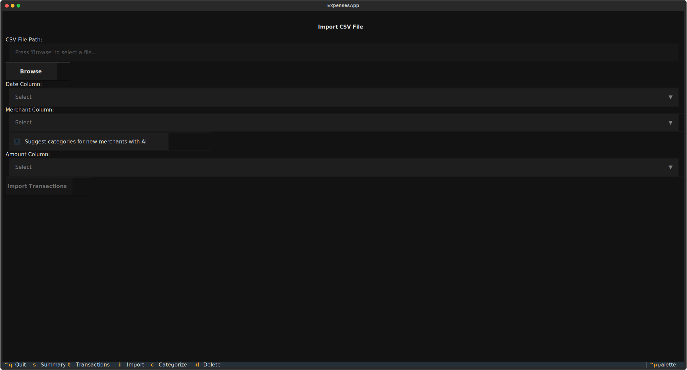
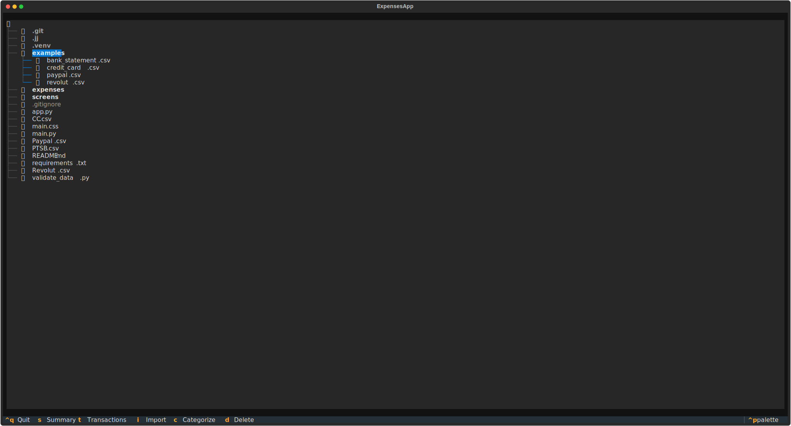
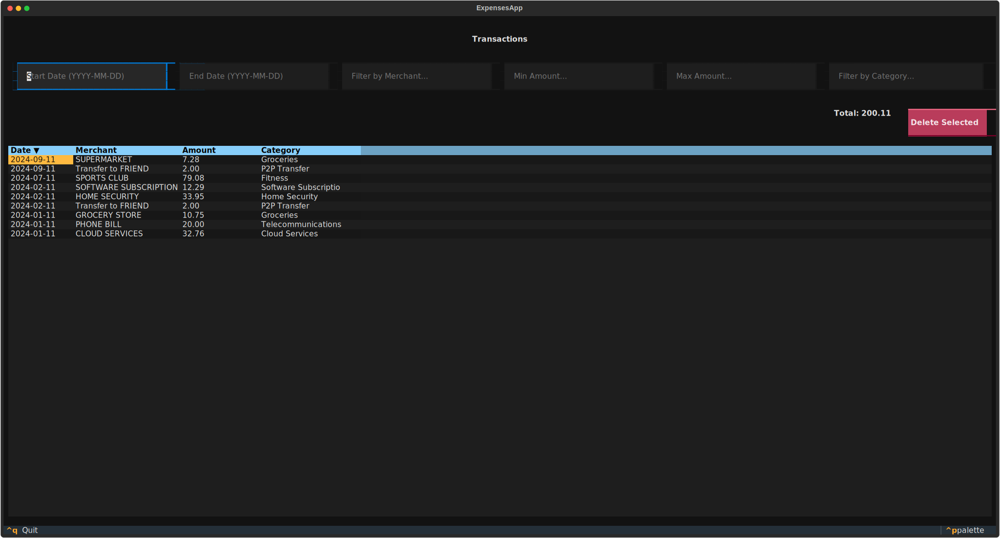
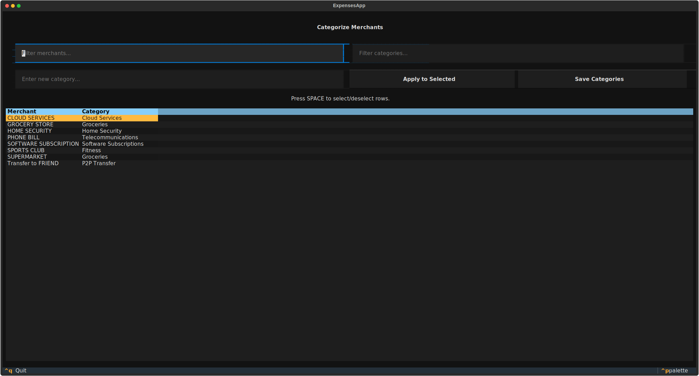
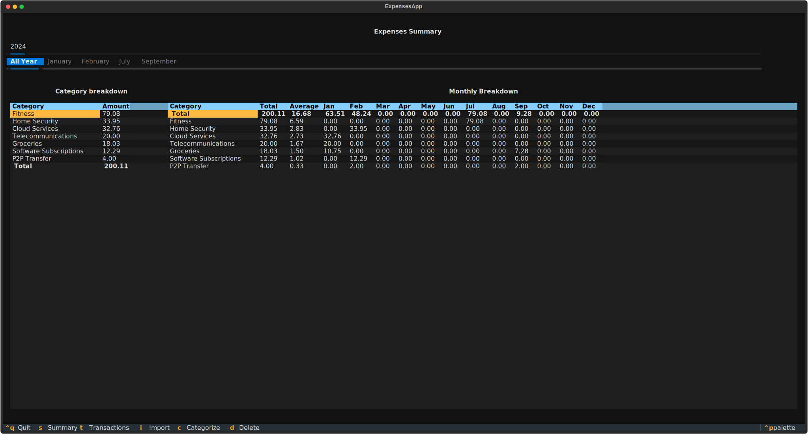

I've been a SRE/PE for a long time, and I've always been a bit of a skeptic when it comes to AI. I've seen technology hype cycles come and go, and I've always believed that there's no substitute for good old-fashioned coding. Even at Meta, where I worked, the AI agents weren't always great, which only reinforced my skepticism. I have been told things are better now... but I disgress.

In recent months, since my return to work, I've started to see things differently. I've been playing around with AI-powered coding assistants, and I've been impressed with their ability to help me get things done faster and more efficiently.

This project was born out of a combination of necessity and curiosity. After [a cycling crash](https://www.strava.com/activities/16256222391) left me with limited capabilities to move and type I ended up with a lot of time on my hands.

The end of the year is approaching and I found myself wanting to get a better handle on my expenses. With my typing ability temporarily reduced, I needed a project that I could work on in short bursts, something that didn't require constant, strenuous typing. This seemed like the perfect opportunity to give "vibe coding" a try to see what all the fuss was about.

So, I decided to put my newfound optimism to the test. I set myself a challenge: to build a Textual user interface for a personal project of mine, an [expenses analyzer](https://github.com/pallotron/expenses_analyzer), with zero prior knowledge of the [Textual](https://github.com/Textualize/textual) framework. I wanted to see if I could "vibe" my way through the development process, relying on AI to guide me and help me learn the ropes.

I'm happy to report that the experiment was a resounding success. I was able to build a functional and visually appealing Textual UI in just a few hours, and I was blown away by how much I was able to achieve with the help of AI.

In this blog post, I'll share my experience of building a Textual UI with the help of AI. I'll talk about the challenges I faced, the things I learned, and how this project has changed my perspective on AI-powered software development.

## The Development Process

My development process was simple: I would describe what I wanted to build to the AI, and it would generate the code for me.

I told myself I would make sure to understand lle the generated code, to learn this new Testual framework and then I would test it out. If it didn't work as expected, I would provide feedback to the AI, and it would generate new code based on my feedback.

I started with the basics, like setting up the main application window and adding a few widgets. Then, I moved on to more complex features, like creating a file browser to import CSV files, displaying transactions in a table, and allowing the user to categorize merchants.

I was impressed by the AI's ability to understand my requests and generate code that was both correct-ish and idiomatic. I was also impressed by its ability to learn from my feedback. For example, when I asked it to create a file browser, it initially generated a simple list of files. But when I asked it to make it more user-friendly, it added features like sorting and filtering.

## Challenges and Learning Moments

Of course, the development process wasn't without its challenges. There were times when the AI would generate code that didn't work as expected, or when I would have to spend some time debugging and troubleshooting. But even in these moments, I found the AI to be a valuable assistant. It would often provide me with helpful suggestions and point me in the right direction.

I added print statements to debug the code, and when I encountered errors, I would describe or copy paste error messages and stack traces to the AI. It would then generate new code that addressed the issues.

One of the biggest learning moments for me was realizing that the AI is not a replacement for a human developer. It's a tool, and like any tool, it's only as good as the person using it. I still had to have a good understanding of the underlying concepts and principles of software development to be able to use the AI effectively.

One thing that I learned is that you have to be aware of the context you operate on, and compress it down every now and then to avoid allucinations.

## The Final Result

In the end, I was able to build a fully functional Textual UI for my expenses analyzer. The application allows the user to import CSV files from their bank, credit card, or PayPal accounts, and then categorize their transactions. It also provides a summary of their spending by category.

Here are some screenshots of the final application:

## Under the Hood: Data Processing and AI Categorization

To handle the financial data efficiently, [Expense Analyzer](https://github.com/pallotron/expenses_analyzer) leverages powerful Python libraries. When you import a CSV file, the data is first loaded into a **[Pandas DataFrame](https://pandas.pydata.org/)**. This allows for robust data manipulation, cleaning, and standardization of column names and data types.

Once processed, your transaction data is stored in the **[Parquet](https://parquet.apache.org/)** format. Parquet is a columnar storage file format known for its efficiency in analytics, offering excellent compression and query performance. This ensures that even as your transaction history grows, the application remains fast and responsive.

One of the most exciting features, and a testament to the power of AI, is the **Automatic Categorization with [Google Gemini](https://deepmind.google/technologies/gemini/)**.

I always hated tracking and categorizing expenses manually. The application can use the Google Gemini API to automatically suggest categories for new merchants it hasn't encountered before. This optional feature significantly streamlines the categorization process, reducing manual effort and making expense analysis much quicker. It truly showcases how AI can augment traditional software development to create more intelligent and user-friendly applications.

I was impressed by the categories suggested by the AI, and it saved me a lot of time. The categorization view in the application allows me to review and adjust the suggested categories as needed.

## Conclusion

This project has been a real eye-opener for me. It's shown me that AI can be a powerful tool for software development, and it's changed my perspective on the future of our industry. I'm no longer a skeptic. I'm a convert.

I believe that AI has the potential to revolutionize the way we build software. It can help us to be more productive, more creative, and more efficient. It can also help us to lower the barrier to entry for new developers, and to make software development more accessible to everyone.

I'm excited to see what the future holds for AI-powered software development. And I'm looking forward to continuing to explore the possibilities of this amazing technology.

If you're curious to try out the Expenses Analyzer, head over to the [GitHub repository](https://github.com/pallotron/expenses_analyzer) and give it a spin! I'd love to hear your thoughts and feedback on how it helps you manage your expenses.
