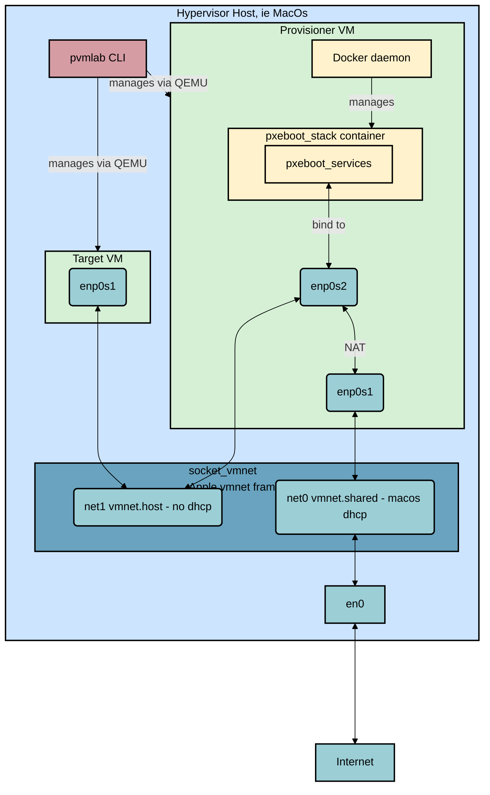

I'm excited to share a new project I've been working on: **pvmlab**.

`pvmlab` is a CLI tool designed to automate the setup of a simple, reproducible virtual pxeboot provisioning lab directly on macOS. It leverages the power of **QEMU**, **[socket_vmnet](https://github.com/lima-vm/socket_vmnet)** (a daemon from the [Lima VM](https://lima-vm.io/) project that exposes Apple's `vmnet.framework` for rootless virtual networking), **cloud-init**, and **Docker** to create a contained environment where you can experiment with network booting and bare-metal provisioning simulations without needing actual hardware.

## Why pvmlab?

The genesis of this project traces back to my summer "funemployed" period, I spent some time doing some personal research into macOS virtualization, virtual networking, and lightweight Docker and Kubernetes environments. My initial goal was to create a cost-effective virtual lab for learning Kubernetes, avoiding the significant investment required for a physical home lab.

Shortly after, I joined Crusoe, the Company has asked me to help re-architect their provisioning stack.

Faced with limited access to a physical hardware lab for development, I realized that my earlier summer prototype could be evolved into a robust solution to unblock my work. Over the course of a month, I developed the tool to orchestrate a multi-VM lab on a single laptop. This included a proof-of-concept PXE boot stack featuring a Dockerized DHCP/TFTP infrastructure and a minimal 8MB initrd with a custom OS installer.

Although the project focus at work eventually shifted, I recognized the value of the tool and continued to develop and refine `pvmlab` independently in my spare time.

Setting up a lab to test PXE booting, DHCP configurations, or OS installers often involves a complex web of VirtualBox bridges, manual network configurations, or dedicated hardware. `pvmlab` aims to streamline this by providing:

* **Isolation:** Uses `socket_vmnet` to create a private, high-performance virtual network.
* **Architecture:** Automatically deploys a "Provisioner" VM (acting as a gateway, DHCP, and TFTP server) and one or more "Target" VMs.
* **Simplicity:** A clean CLI to create, start, stop, and clean up the entire lab.
* **Cleanliness:** All artifacts (disks, logs, configs) are stored in `~/.pvmlab/`, keeping your workspace tidy.

## Key Features

* **Automated VM Creation:** Quickly spin up Ubuntu or Fedora VMs from cloud images.
* **Dual-stack Networking:** The private network supports both IPv4 and IPv6.
* **Direct SSH Access:** Connect to any VM with `pvmlab vm shell <name>`.
* **Cross-Architecture:** Support for creating both `x86_64` and `aarch64` VMs (host dependent for acceleration).

## Architecture

`pvmlab` creates a self-contained environment on your Mac. Here is a high-level view of how the components interact:



The **Provisioner VM** acts as the router and server for the **Target VM**, providing DHCP, DNS, and the boot files needed for PXE booting. The `socket_vmnet` daemon manages the networking plumbing, ensuring isolation while allowing the Provisioner to reach the internet.

## A Side Story: Diving into socket_vmnet

One of the key challenges I faced while building `pvmlab` was a conflict between macOS's built-in DHCP server and my own. When you create a `vmnet-host` network using Apple's `vmnet.framework`, macOS helpfully spins up its own DHCP server — which is great for most use cases, but a disaster when you're trying to run your own `dhcpd` for PXE booting. The two servers would race to respond to DHCP requests, making the setup unreliable.

I discovered that QEMU's native vmnet support already handles this via a `net-uuid` parameter, which internally sets the `vmnet_network_identifier_key` — an option available since macOS 11.0 that creates an isolated host network with no DHCP service. However, `socket_vmnet` (the tool that lets you use vmnet without `sudo`) didn't expose this option.

So I dug into the `vmnet.framework` headers, filed an [issue](https://github.com/lima-vm/socket_vmnet/issues/139), and put together a [pull request](https://github.com/lima-vm/socket_vmnet/pull/141) to add a `--vmnet-network-identifier` flag. The review process was a learning experience in itself — the maintainers pushed back on unnecessary complexity, asked great questions about the Apple API semantics, and helped shape the feature into something clean and focused. After a few rounds of feedback (and a bicycle incident that slowed things down), the PR was merged.

Interestingly, Apple is aware that this mechanism is confusing — a new `vmnet_network_configuration_disable_dhcp()` API is coming in macOS 26.0 (Tahoe) that will make this much more explicit. But for now, the network identifier approach is the way to go.

## Use Cases

I built `pvmlab` primarily to have a sandbox for:

* **Testing OS Installers:** Iterating on Ubuntu Autoinstall or Preseed configurations.
* **Network Boot Development:** Developing and testing iPXE scripts.
* **Simulated Bare-Metal:** Simulating a real data center provisioning flow locally.
* **Infrastructure Playground:** Testing tools like Tinkerbell or MAAS.
* **IaC Learning:** Writing Terraform, Tofu, or Pulumi resources to declare and spin up/down VMs and provision them.

## Getting Started

If you are on macOS, you can install it via Homebrew:

```bash
brew tap pallotron/pvmlab
brew install pvmlab
sudo pvmlab system setup-launchd
```

Check out the [GitHub Repository](https://github.com/pallotron/pvmlab) for full documentation and usage examples.

Hope this could be helpful to people that want to learn about PXE booting and bare-metal provisioning!
