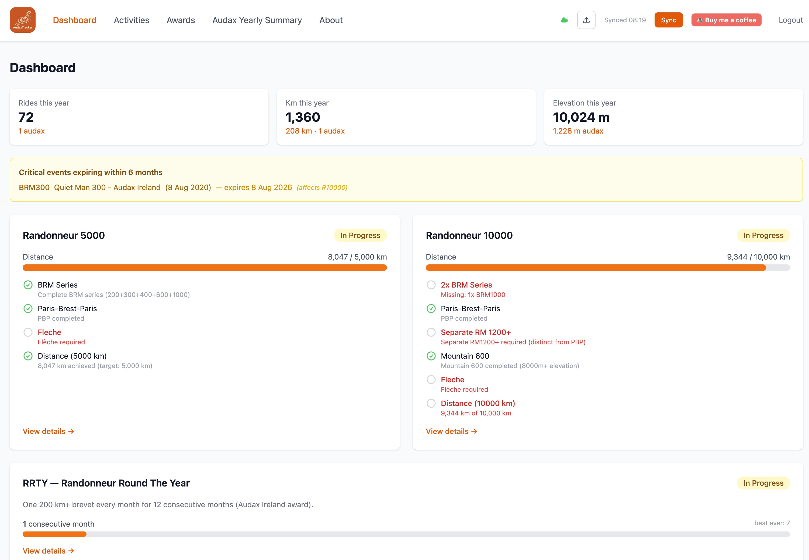
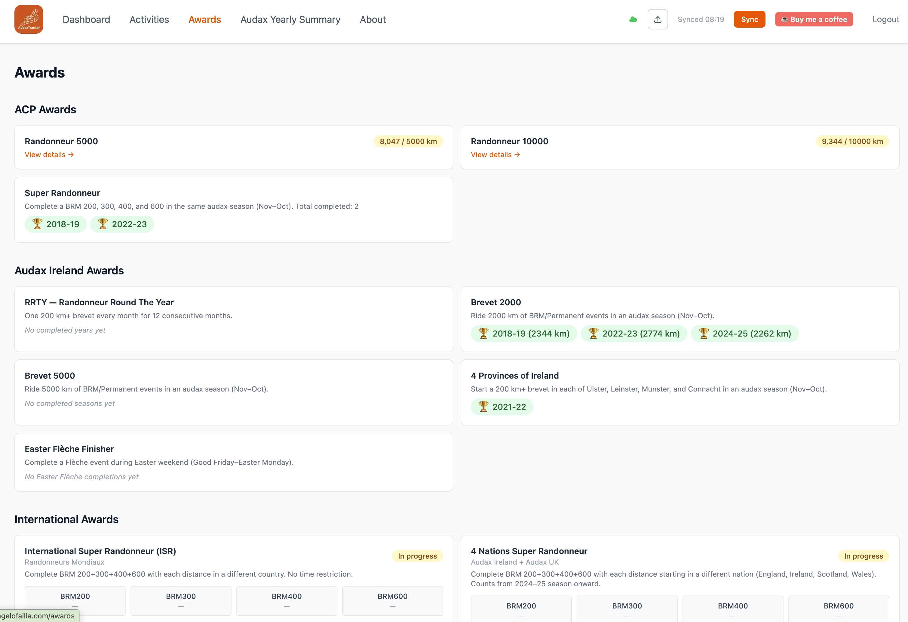
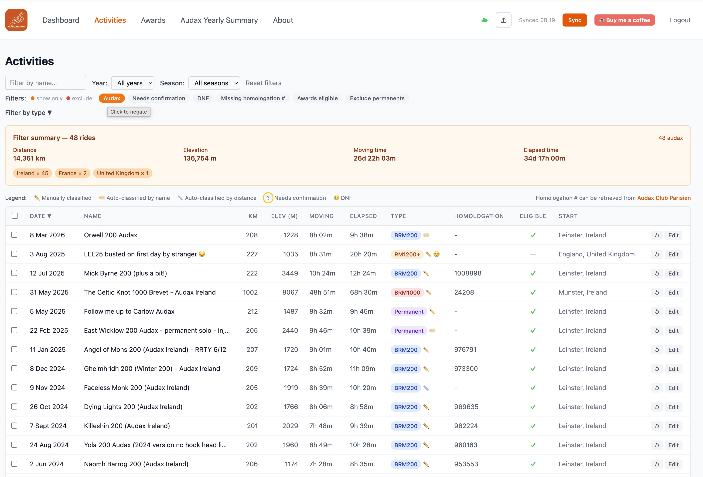

I have been riding audax events for a few years now. If you are not familiar with
the sport, [audax](https://en.wikipedia.org/wiki/Audax_cycling) (also called
randonneuring) is long-distance unsupported cycling. Rides are called
**brevets** and they come in standard distances: 200, 300, 400, and 600 km.
You ride within a time limit, collect stamps at checkpoints, and that is it.
No racing, no prizes, just you and the road.

Like most randonneurs, I got hooked on chasing awards. The most well-known is
the **Super Randonneur** (SR): complete a 200, 300, 400, and 600 km brevet in
a single season (which runs November to October). From there, the rabbit hole
goes deep: lifetime awards, international qualifications, round-the-year
challenges, and more.

The problem? Tracking all of this manually is a pain.

## The Spreadsheet Era

For a while I kept a spreadsheet. I would log each ride, figure out which
award categories it contributed to, and update counts by hand. It worked, but
it was tedious. And since seasons span November to October (not January to
December), the calendar arithmetic alone was enough to cause confusion.

I also ride in multiple countries, which matters for awards like the **4 Nations
Super Randonneur** (you need a full SR series in Ireland, England, Scotland, and
Wales) and the **International Super Randonneur** (same idea, but any four
countries). Keeping track of where each ride took place added another layer of
complexity.

At some point I decided to just build something.

## A Small Confession

Here is the thing: I am not a frontend developer. I am a systems and
infrastructure engineer. My last serious web development experience was around
2004 and 2005, back when **AJAX** was the hot new thing and we were all marvelling
that you could update part of a page without a full reload. XMLHttpRequest felt
like magic. We were building what people were just starting to call Web 2.0.

Then I went deep into Linux, networking, and distributed systems, and I never
really came back to the frontend world. React, TypeScript, Vite, Tailwind, the
whole modern JavaScript ecosystem: I knew these things existed, but I had not
touched them.

So how did a 2004-era web developer end up shipping a React 19 app with
TypeScript, Tailwind CSS v4, and Cloudflare Workers in 2026?

**[Claude Code](https://claude.ai/claude-code).**

I used Claude Code as my pair programmer throughout this entire project. Not
just for boilerplate or syntax lookups, but as a genuine collaborator. I would
describe what I wanted, it would write the code, I would read it carefully,
ask questions, push back on things I did not understand, and we would iterate.
It was the most productive I have ever felt working outside my area of expertise.

The experience was genuinely surprising. I could hold a conversation like: "I
want all activity data stored locally in the browser, no backend database, and
I want it to survive a page refresh." Claude would pick IndexedDB, explain why,
reach for Dexie.js, and wire it up. I would read the result, understand it, and
if something looked off I would say so. That feedback loop worked really well.

I still wrote a fair amount of the business logic myself, particularly the award
qualification rules, because that required deep knowledge of the ACP regulations
that no language model was going to have reliably. But the scaffolding, the React
component structure, the Strava OAuth flow, the Cloudflare Worker: Claude did
the heavy lifting and I guided the decisions.

It gave me back a feeling I had not had in a long time: the feeling of being
able to build whatever I can imagine, even in an unfamiliar domain.

## What Audax Tracker Does

[Audax Tracker](https://github.com/pallotron/audax_tracker) is a web app that
connects to your Strava account, pulls in your activities, classifies them as
brevets (or not), and shows your progress toward a set of annual and lifetime
awards.

On first login it does a bulk import of your Strava history. After that, it only
fetches new activities. Classification is automatic: the app looks at ride names
and descriptions for keywords like `BRM`, `Brevet`, `PBP`, `Fleche`, and `SR600`,
and falls back to distance heuristics when names are ambiguous. You can always
override any classification manually and attach a homologation number.

The **Dashboard** gives you an at-a-glance view of your season: rides, km, and
elevation, plus progress cards for the awards you are actively working toward.

The **Awards** page lists every award category with your completion status,
earned trophies by season, and progress toward in-progress qualifications.

The **Activities** page is the full log of your classified rides. You can filter
by type, year, season, and a handful of other criteria, and edit any ride to
correct its classification or add a homologation number.

The awards it tracks include:

* **Super Randonneur** (SR) - 200, 300, 400, and 600 km in a single season
* **Randonneur Round The Year** (RRTY) - at least one 200 km ride every month for 12 consecutive months
* **Brevet 2000 / 5000 km** - distance totals in a season
* **4 Provinces of Ireland** - qualifying rides starting in each Irish province
* **Easter Fleche** - a team event held over Easter weekend
* **4 Nations Super Randonneur** - SR series in each of the four home nations
* **International Super Randonneur** - SR series in four different countries
* **ACP R5000 / R10000** - the advanced international qualifications with rolling time windows and mandatory event types

## Technical Choices

The app is built with **React 19** and **TypeScript**, bundled with Vite, and
styled with **Tailwind CSS v4**. Routing is handled by React Router v7.

The most interesting architectural decision was to make it **completely
offline-first**. All activity data, award state, and user classifications are
stored in the browser's **IndexedDB** via [Dexie.js](https://dexie.org/).
There is no backend database. No personal data leaves your browser except for
the calls to the Strava API itself.

This had a nice side effect: the app is fast. There is no round-trip to a server
to load your dashboard. Everything is local.

For **Strava OAuth**, I needed a small server component to keep the
`client_secret` out of the browser. I used a **Cloudflare Worker** for this.
It handles the OAuth callback and token refresh, and that is all it does.
The frontend and the worker are both deployed via **Cloudflare Pages** and
**Cloudflare Workers**, wired up through GitHub Actions.

## Geocoding and the Northern Ireland Problem

One tricky bit was geographic classification. Several awards care about which
country or province a ride took place in. To figure this out, the app geocodes
the start coordinates of each activity using a reverse geocoding API.

The interesting edge case is Northern Ireland. For cycling award purposes,
Northern Ireland is treated as part of Ireland (it rides as the Ulster province
in events organised by Audax Ireland). But geocoding returns it as United
Kingdom. I had to add explicit handling for this: if the start coordinates fall
within Northern Ireland, the app overrides the country to Ireland and sets the
province to Ulster.

Small detail, but it matters if you are chasing the 4 Provinces award.

## What I Learned

A few things stood out during this project:

* **IndexedDB is surprisingly capable.** I had some hesitation about using it as
  the primary data store, but Dexie.js makes the API pleasant to work with and
  it handles the data volumes easily.
* **Cloudflare Workers are great for tiny server tasks.** The OAuth worker is
  about 50 lines of TypeScript. Deploying it alongside the frontend with no
  extra infrastructure is very convenient.
* **Award logic is fiddly.** The rules for ACP R5000/R10000 involve rolling
  12-month windows, multiple BRM series requirements, and specific mandatory
  events like Paris-Brest-Paris. Getting this right required careful reading
  of the ACP regulations and a fair amount of test coverage.
* **AI-assisted development is a real skill.** Knowing how to steer Claude,
  what to accept, what to question, and where to insist on your own judgment:
  that takes practice. The output is only as good as the conversation.

## Try It

The app is live at [audax-tracker.angelofailla.com](https://audax-tracker.angelofailla.com).
If you ride audax and use Strava, you can connect your account and see your
awards dashboard right away. The project is also **open source**, so if you prefer
to run it yourself you can deploy it on your own infrastructure, domain, or
hosting provider of choice.

One caveat: Strava requires applications to go through an approval process before
they can serve more than a handful of users. I have submitted the app for review
and I am working on getting the quota increased, but in the meantime you may
experience some API throttling if many people are using it at the same time.
Hang tight if that happens.

The [About page](https://audax-tracker.angelofailla.com/about) has a full
description of every supported award and how the classification logic works.

Source code: [github.com/pallotron/audax_tracker](https://github.com/pallotron/audax_tracker)

Good luck out there, and may your brevets be stamped.
