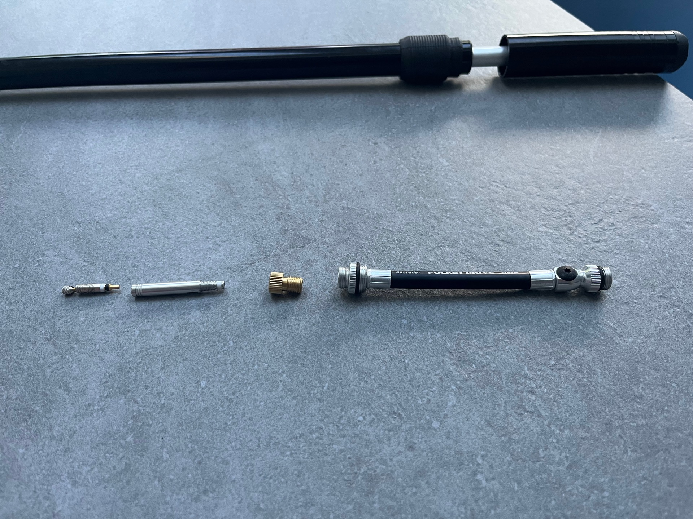
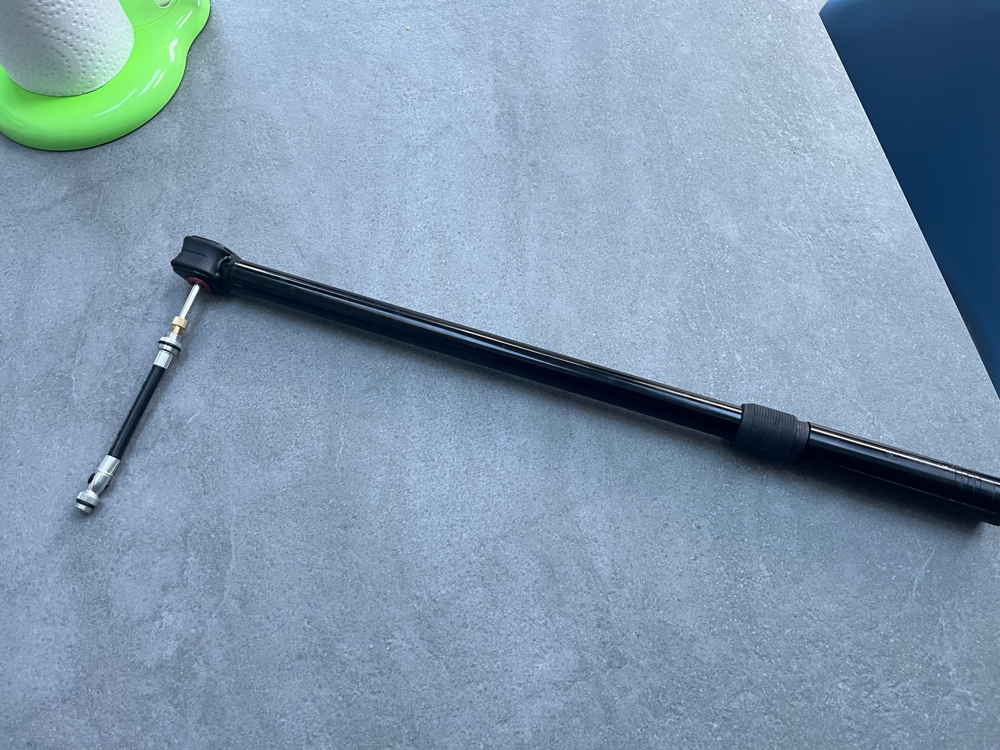
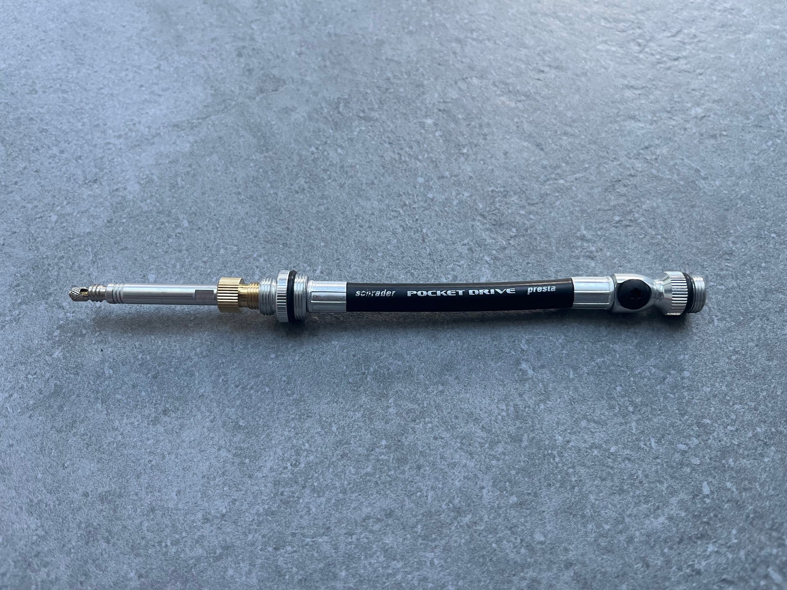

At the [Easter Fleche](https://www.strava.com/activities/17975409428) this year I
had a puncture. I swapped in a fresh TPU tube roadside, pulled out the
[Silca Impero Ultimate II](https://silca.cc/products/impero-ultimate-frame-pump)
and pumped it up. Everything felt fine. I got back on the bike and finished
the event without further incident.

A few weeks later I rode the [Eoin McLove 600](https://www.strava.com/activities/18364161281).
Six hundred kilometres, no mechanicals, bike felt completely normal all the way
through. When I got home and was checking the bike over, I noticed the rear valve
stem looked slightly crooked — just a few degrees off-centre. I thought nothing
of it, put the bike away, and went to bed.

The next morning the rear tyre was soft.

It took me a moment to connect the dots. The crooked valve stem wasn't just
cosmetic — it had been stressed at the base during the Fleche pump and was leaking slowly. The Silca
Impero is a frame pump: you brace it against the valve and push hard. That force
isn't purely axial. There's always some lateral component, and for a butyl tube
that's fine — the valve stem is stiff enough to take it. But TPU valve stems are
thinner and more flexible. Push hard at the wrong angle and they bend. Once bent,
the seal at the base can start to weep.

Rather than relying on willpower to be more careful next time (mid-event,
four hundred kilometres in), I built a small adapter from salvaged parts:

- the ABS hose from a broken Lezyne Pocket Drive
- a Schrader/Presta adapter
- a valve extender
- a valve core (seated inside the extender)

The extender threads onto the valve stem. The adapter bridges Presta to Schrader.
The Lezyne ABS hose connects the adapter to the pump head. The hose is flexible —
any angular force from the pump is absorbed by the hose, not transmitted to the
valve stem.

It adds about thirty seconds to the inflation process, which is nothing compared
to diagnosing a slow leak four hundred kilometres into a 600.

TPU tubes are worth it. They are significantly lighter than butyl and robust
enough for long-distance riding. But they reward care at the valve — especially
when using a frame pump. If you are buying new, some manufacturers now offer TPU
tubes with metal valve stems, which are much more resistant to this kind of
damage. Worth considering if you pump roadside regularly.
